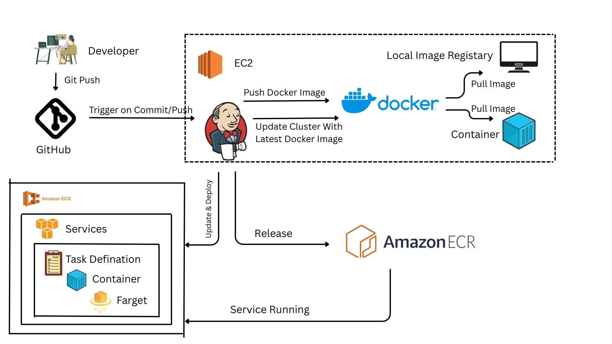

## DevOps Task: CI/CD Pipeline for Node.js App on AWS ECS

This project demonstrates a complete CI/CD pipeline for deploying a containerized Node.js application to AWS ECS using Jenkins, DockerHub, and CloudWatch logging. It automates the build, push, and deployment process with robust monitoring and role-based access.



---

## Tech Stack

- **Frontend/Backend**: Node.js  
- **CI/CD**: Jenkins  
- **Containerization**: Docker  
- **Image Registry**: DockerHub  
- **Cloud Provider**: AWS (ECS Fargate, IAM, CloudWatch)  
- **Version Control**: GitHub  

---

## Pipeline Workflow

1. **Code Push**: Developer pushes code to GitHub  
2. **Jenkins Trigger**: GitHub webhook triggers Jenkins pipeline  
3. **Build & Dockerize**: Jenkins builds Docker image from `Dockerfile`  
4. **Push to DockerHub**: Image is pushed to DockerHub  
5. **Deploy to ECS**: Jenkins triggers ECS service update using AWS CLI  
6. **Logging**: ECS task logs are streamed to CloudWatch  

---

## Project Structure

DevOps_Task/ 
├── Dockerfile 
├── Jenkinsfile 
├── app.js 
├── package.json 
└── README.md

---

## Prerequisites
To automate the deployment of a Node.js application to AWS ECS Fargate using Jenkins on an EC2 instance, here are some prerequisites you'll typically need:

1. **AWS Account**: You'll need an AWS account to create ECS Fargate clusters and manage other AWS resources.

2. **EC2 Instance**: Set up an EC2 instance where Jenkins will run. This instance should have Java installed (needed for Jenkins) and access to AWS services via IAM roles.

3. **Jenkins**: Install Jenkins on your EC2 instance. You can follow the official Jenkins installation guide for this or please refer to my previous article. click here

4. **Node.js Application**: Have a Node.js application ready that you want to deploy.

5. **Docker**: Your Node.js application should be Dockerized. This means creating a Dockerfile to package your Node.js app into a Docker image.

6. **AWS ECS**: Understand the basics of ECS (Elastic Container Service) and Fargate, as you'll be deploying Docker containers to ECS Fargate.

7. **IAM Role**: Create an IAM role with the necessary permissions for Jenkins to interact with AWS services like ECS.

8. **AWS CLI**: Install AWS CLI on your Jenkins EC2 instance to interact with AWS services from Jenkins scripts or you can use EC2 connect session manager.

9. **Jenkins Plugins**: Install necessary Jenkins plugins like AWS Pipeline Plugin, Docker Pipeline Plugin, etc., depending on your pipeline needs.

10. **Pipeline Script**: Prepare a Jenkins pipeline script (usually written in Groovy) that defines the steps to build your Docker image, push it to a Docker registry (like ECR - Elastic Container Registry), and deploy it to ECS Fargate.

These are the foundational prerequisites. Each step will involve detailed configuration and setup, but these points cover the essential groundwork for automating your Node.js application deployments using Jenkins and AWS ECS Fargate.

---

## CI/CD Pipeline Setup Guide

---

## Source Code & Version Control

# Fork & Clone 
1. Fork or Clone this repo to your GitHub account and clone it locally.

# Branching Strategy
1. **main**: Stable production-ready code
2. **dev**: Active development and feature testing
3. Use Pull Requests to merge **dev** → **main** with code reviews

---

## Set Up Jenkins

# Launch an EC2 instance (Ubuntu) and install Jenkins
```bash
sudo wget -O /etc/yum.repos.d/jenkins.repo \
    https://pkg.jenkins.io/redhat/jenkins.repo
sudo rpm --import https://pkg.jenkins.io/redhat/jenkins.io-2023.key
sudo yum upgrade
# Add required dependencies for the jenkins package
sudo yum install fontconfig java-21-openjdk
sudo yum install jenkins
sudo systemctl enable jenkins
sudo systemctl start jenkins
sudo systemctl status jenkins
```

# Access Jenkins at http://<your-ec2-ip>:8080 Unlock it using:
```bash
sudo cat /var/lib/jenkins/secrets/initialAdminPassword
```

# Install plugins:
1. GitHub Integration
2. Docker Pipeline
3. AWS CLI
4. Pipeline

---

## Create Jenkins Pipeline Job

# Create a Pipeline Job in Jenkins
# Add GitHub repo URL and set up webhook:
1. Go to GitHub → Settings → Webhooks → Add webhook
2. Payload URL: http://<jenkins-ip>:8080/github-webhook/
3. Content type: application/json
4. Trigger: push

# Jenkinsfile (Declarative Pipeline)
1. You check File in My Repo
2. Add a Jenkinsfile to your repo root

---

## AWS ECS Setup

# ECS Setup
1. Go to AWS Console → ECS → Create Cluster (Fargate preferred)

# Create a Task Definition:
1. Use DockerHub image
2. Set CPU, memory, and port mappings
3. Enable CloudWatch logging

# Create ECS Service:
1. Attach to cluster
2. Use ALB (Application Load Balancer) for traffic
3. Set desired task count (e.g., 2)

---

## Monitoring & Logging

# CloudWatch Setup
1. Enable logging in ECS Task Definition

# Viewing Logs & Metrics
1. Go to AWS CloudWatch → Log Groups → /ecs/logo-server
2. View CPU, memory, and network metrics under ECS → Cluster → Service → Metrics

---

## Troubleshooting

1. **Webhook not triggering**: Check GitHub → Settings → Webhooks
2. **Jenkins can't clone repo**: Add GitHub PAT as credentials
3. **Docker push fails**: Verify DockerHub credentials in Jenkins
4. **ECS task stuck**: Check IAM role and task definition logs
